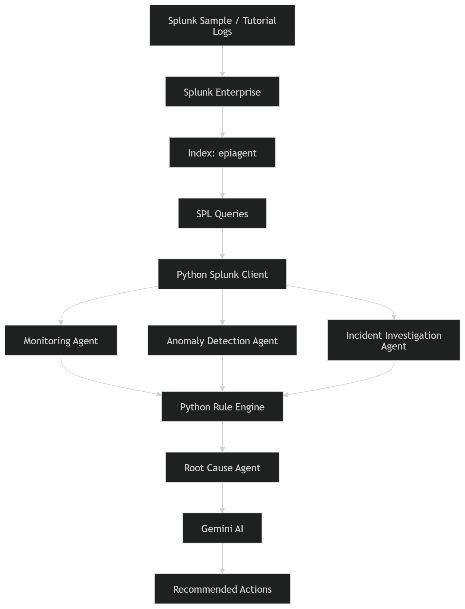
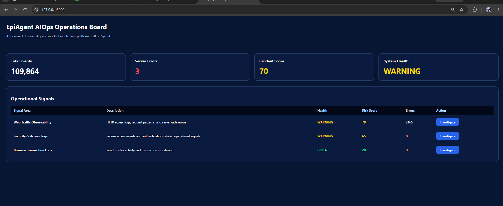
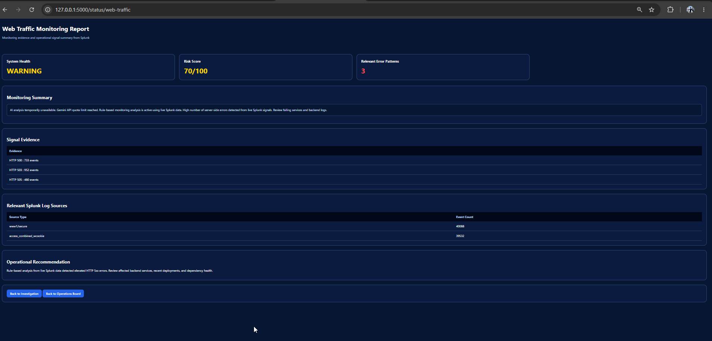
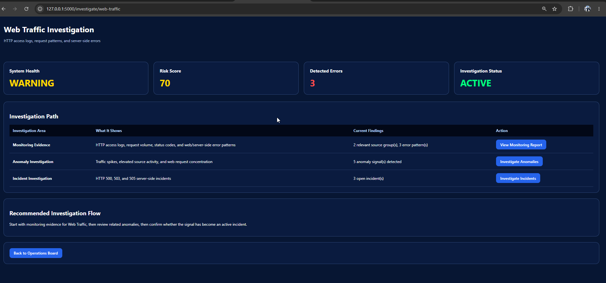
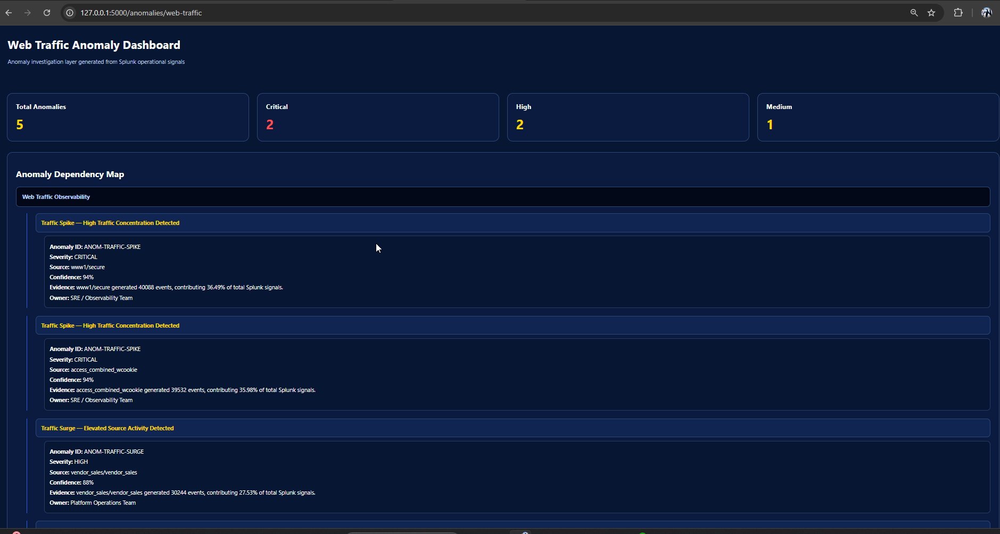
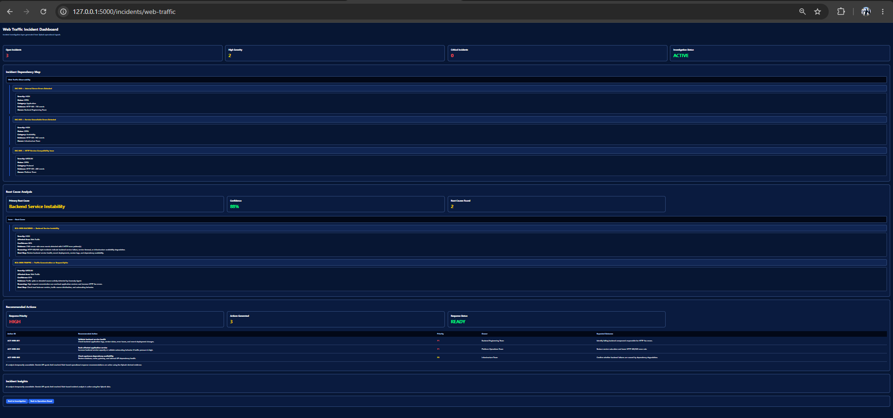
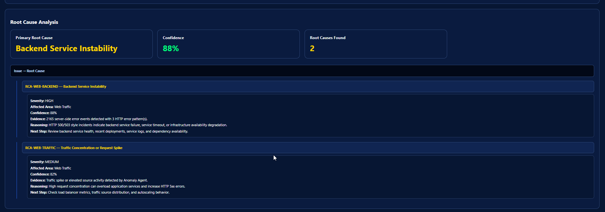
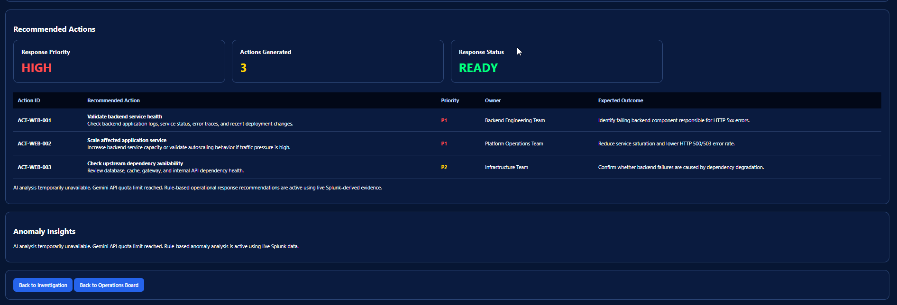
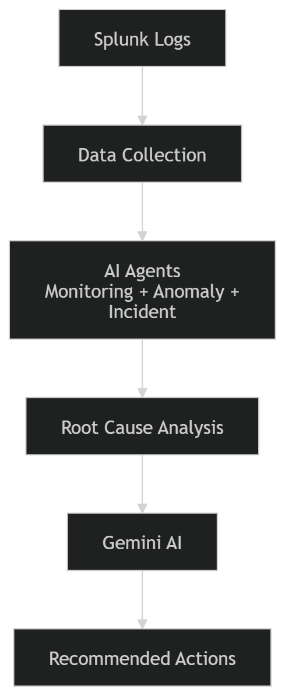
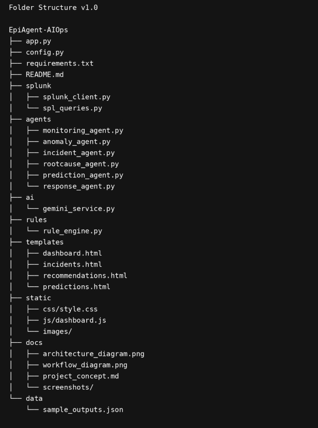

# EpiAgent AIOps

## AI-Powered Operational Intelligence Platform Built on Splunk

EpiAgent AIOps is an AI-powered operational intelligence platform built on Splunk that helps engineering and operations teams better understand system behavior, detect anomalies earlier, investigate incidents faster, and automate operational response workflows.

The platform continuously analyzes logs, alerts, metrics, and system events to identify unusual patterns and emerging risks across monitored services. When an anomaly or incident is detected, EpiAgent AIOps automatically investigates the event, correlates relevant operational signals, identifies probable root causes, and generates actionable recommendations for resolution.

By combining observability data with AI-driven analysis, EpiAgent AIOps transforms raw telemetry into actionable operational intelligence.

---
# Architecture



---
# Screenshots

## Portfolio Dashboard



## Monitoring Report



## Investigation Hub



## Anomaly Dashboard



## Incident Dashboard



## Root Cause Analysis & Recommended Actions




---
## Architecture Explanation

EpiAgent AIOps uses Splunk Enterprise as the observability foundation. Splunk sample/tutorial logs are ingested into a dedicated index named `epiagent`.

SPL queries extract operational signals such as:

- Traffic patterns
- Error counts
- HTTP status trends
- Anomaly indicators
- Incident evidence
- Service degradation signals

A Python backend connects to Splunk using the Splunk SDK and passes the search results into specialized agents.

### Agent Workflow

1. Monitoring Agent
2. Anomaly Detection Agent
3. Incident Investigation Agent
4. Root Cause Agent
5. Gemini AI
6. Operational Response Agent
7. Prediction Agent

The final output provides system health, anomalies, root causes, risk predictions, and recommended operational actions.

---

# Project Flow



---

# Key Features

## 1. Splunk Data Ingestion
Uses Splunk tutorial/sample logs and ingests them into a dedicated Splunk index.

## 2. Splunk Query Layer
Executes SPL queries to extract operational intelligence.

## 3. Monitoring Agent
Analyzes system health, events, and operational metrics.

## 4. Anomaly Detection Agent
Detects unusual patterns and abnormal behavior.

## 5. Incident Investigation Agent
Collects incident evidence and operational context.

## 6. Root Cause Agent
Identifies probable causes using correlated operational signals.

## 7. Prediction Agent
Predicts potential service degradation and operational risks.

## 8. Operational Response Agent
Generates actionable recommendations.

## 9. Gemini AI Integration
Produces human-readable incident summaries and recommendations.

## 10. EpiAgent AIOps Dashboard
Unified operational intelligence dashboard.

## 11. Incident Report View
Provides structured incident analysis reports.

## 12. Architecture & Documentation
Includes architecture diagrams, setup guides, and documentation.

---

# Technology Stack

- Splunk Enterprise 10.4.0
- Python
- Flask
- Splunk Python SDK
- SPL (Search Processing Language)
- Gemini AI
- HTML
- CSS
- Jinja2 Templates

---

# Project Structure



---

# Setup

## Install Dependencies

```bash
pip install -r requirements.txt
```

## Configure Environment

```env
SPLUNK_HOST=localhost
SPLUNK_PORT=8089
SPLUNK_USERNAME=your_splunk_username
SPLUNK_PASSWORD=your_splunk_password
SPLUNK_INDEX=epiagent
AI_ENABLED=true
```

## Run Application

```bash
python app.py
```

---

# Demo Workflow

1. Start Splunk Enterprise
2. Ingest tutorial/sample logs
3. Run EpiAgent AIOps
4. Monitoring Agent analyzes telemetry
5. Anomaly Agent detects abnormal patterns
6. Incident Agent gathers context
7. Root Cause Agent identifies probable causes
8. Prediction Agent identifies future risks
9. Gemini AI generates recommendations
10. Dashboard displays operational insights

---

# Inspiration

Every operations team faces the same challenge.

Critical information is scattered across logs, alerts, metrics, incidents, and monitoring dashboards. When a production issue occurs, engineers often spend valuable time manually correlating events, identifying root causes, and determining the next course of action.

By the time the real problem becomes visible, customer experience, service availability, and business operations may already be affected.

**What if an AI agent could continuously analyze operational data, investigate incidents, predict risks, and recommend actions before small issues become major outages?**

That question became **EpiAgent AIOps**.

---

# What It Does

EpiAgent AIOps continuously analyzes logs, alerts, metrics, and system events to identify unusual patterns and emerging risks across monitored services.

When an anomaly or incident is detected, the platform:

- Investigates the event automatically
- Correlates operational signals
- Identifies probable root causes
- Predicts service degradation risks
- Generates actionable recommendations
- Produces AI-powered incident summaries

The platform combines Monitoring, Anomaly Detection, Incident Investigation, Root Cause Analysis, Prediction, and Operational Response agents into a unified operational intelligence workflow.

---

# How We Built It

We built EpiAgent AIOps on top of Splunk Enterprise using a licensed Splunk Developer environment.

Operational data from logs, alerts, metrics, and system events is ingested into Splunk, indexed, and analyzed using SPL queries.

The platform consists of:

- Monitoring Agent
- Anomaly Detection Agent
- Incident Investigation Agent
- Root Cause Analysis Agent
- Prediction Agent
- Operational Response Agent
- Gemini AI Integration

The backend was developed in Python and integrates directly with Splunk to retrieve operational insights. A web-based dashboard provides a unified view of system health, anomalies, incident investigations, predictions, and AI-generated recommendations.

---

# Challenges We Ran Into

- Transforming raw observability data into actionable operational intelligence
- Designing agent workflows capable of event correlation and root cause analysis
- Balancing implementation scope within the hackathon timeline
- Integrating Python services with Splunk APIs and SDKs
- Building SPL queries that generate meaningful operational insights
- Converting raw search results into structured AI-agent inputs

---

# Accomplishments That We're Proud Of

- Built a working AI-powered AIOps platform integrated with Splunk Enterprise
- Successfully executed live SPL queries against operational data
- Developed a multi-agent operational intelligence architecture
- Connected Splunk SDK with AI-driven workflows
- Generated AI-assisted incident recommendations from real telemetry data
- Delivered an end-to-end operational intelligence dashboard

---

# What We Learned

Through this project we gained practical experience in:

- Splunk Enterprise
- SPL Query Development
- Observability Engineering
- Operational Analytics
- AI-Assisted Incident Investigation
- Agent-Based System Architecture

We learned that collecting telemetry is only the first step. The real challenge is correlating signals, identifying meaningful patterns, and converting large volumes of observability data into actionable decisions.

---

# Business Impact

EpiAgent AIOps helps organizations:

- Detect anomalies earlier
- Reduce Mean Time To Detect (MTTD)
- Accelerate Root Cause Analysis
- Improve Operational Visibility
- Predict Service Degradation Risks
- Reduce Incident Resolution Time
- Enable Proactive Operations

Instead of reacting to incidents, teams can proactively prevent service disruptions.

---

# What's Next for EpiAgent AIOps

Our next goal is to evolve EpiAgent AIOps from an AI-assisted operational intelligence platform into an autonomous AIOps system capable of continuously monitoring enterprise environments, investigating incidents, and proactively recommending remediation actions.

Future enhancements include:

- Real-time streaming data support
- Advanced anomaly detection models
- Automated incident remediation workflows
- Cloud and DevOps platform integrations
- Enterprise-scale observability support
- Multi-environment monitoring
- AI-powered operational copilots
- Predictive service degradation analysis
- Autonomous operational decision support

Our long-term vision is to help organizations move beyond reactive monitoring and build truly proactive, AI-driven operations.
